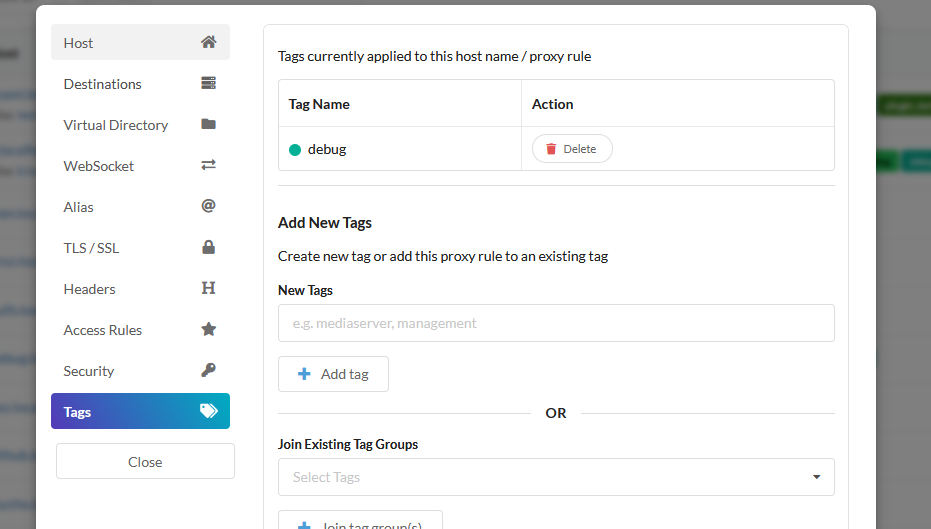
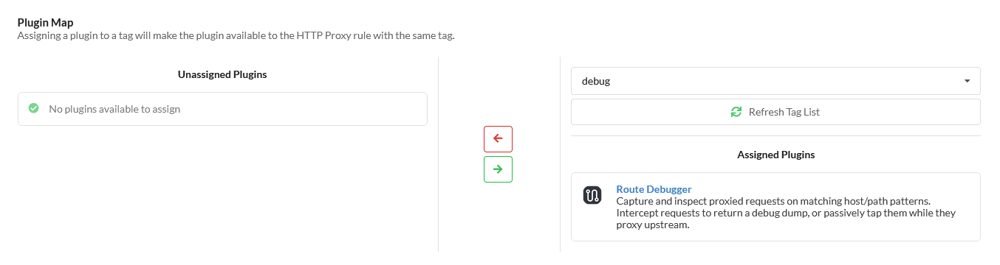
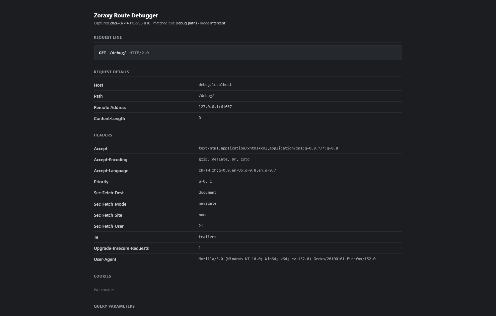
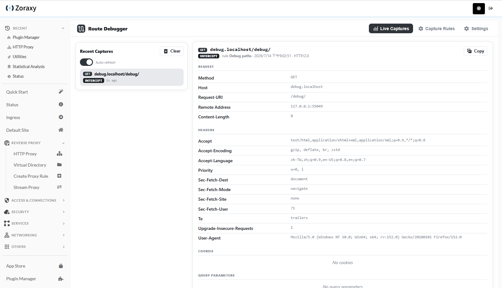
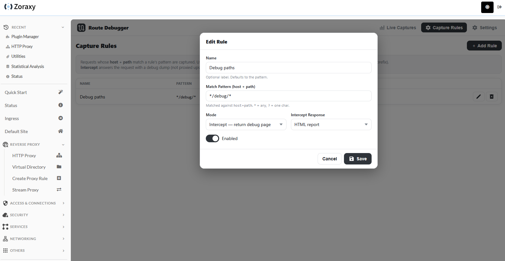

# Route Debugger

A dynamic-capture plugin for [Zoraxy](https://github.com/tobychui/zoraxy) that captures and inspects
proxied HTTP requests matching host/path patterns you define. It replaces the old built-in "Route
Debugger" core feature with a more flexible, production-friendly plugin.

## What it does

Define **capture rules** — a glob pattern matched against `host + path` (e.g. `my.example.com/test/*`
or `*/debug/*`). When a proxied request matches a rule, one of two things happens:

- **Intercept** — the request is answered directly with a full debug dump (method, headers, cookies,
  query parameters and body) instead of being forwarded upstream. The response is a styled HTML page
  or plain text (curl-friendly), chosen per rule.
- **Tap** — the request is logged to the dashboard but still proxied upstream normally, so the client
  gets the real response. Non-intrusive; safe to leave on in production. (Body is not captured in tap
  mode — the body is only available once a request is intercepted.)

Every capture is recorded in an in-memory log you can browse from the plugin's admin UI. Nothing is
persisted to disk, since captures can contain sensitive data.

## Usage

1. Enable the plugin in Zoraxy (Plugins page).
2. Open the plugin UI and add a capture rule under **Capture Rules**.
3. Attach the plugin to the HTTP proxy hosts you want it to watch: add the plugin to a **plugin group
   (tag)** and assign that tag to the proxy rule. Dynamic captures only run for hosts carrying a tag
   that the plugin belongs to.
4. Send a request that matches your pattern and watch it appear under **Live Captures**.

### How to add a tag and assign plugin to the tag

1. Create a tag on a HTTP Proxy Rule
   
2. In the Plugin Manager, select the tag and assign the plugin to it
   

## Pattern syntax

Patterns are matched against `<host><path>` and anchored at the start (prefix semantics):

- `*` matches any run of characters (including `/`)
- `?` matches a single character

| Pattern                   | Matches                                             |
| ------------------------- | --------------------------------------------------- |
| `*/debug/*`               | `/debug/...` on any host                            |
| `my.example.com/test/*`   | anything under `/test/` on `my.example.com`         |
| `api.example.com/*`       | every request to `api.example.com`                  |

## Build

```bash
make build      # local binary for the current platform
make all        # cross-compile release binaries into ./build
```

The admin UI is embedded via `//go:embed www/*`; when a `./www` folder exists next to the binary
(source-tree runs) it is served live for development.


## Screenshots







## License

MIT
